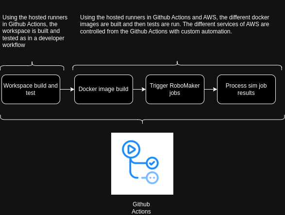
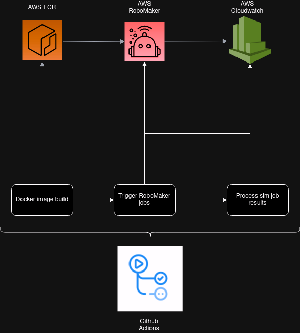

# andino_integration_tests

## Description

This repository contains a set of simple tests that evaluate the
[Andino](https://github.com/Ekumen-OS/andino) robot within a simulation environment.
It runs in ROS 2 Humble with Gazebo 11.

Within the `andino_tests` package you will find a basic ROS 2 Python package with only
tests that cover:

- Format, Copyright and linting.
- Basic Andino robot model integration in the simulation.
- Basic Andino - localization (AMCL) test when using AMCL integration.
- Basic Andino mobility, i.e. the robot can move when sending Twist commands.
- Basic Andino navigation, i.e. the robot can go to a specified pose.

These tests are basic, do not offer anything novel, however, they can be used as part
of a regression testing pipeline to verify that everything runs smoothly while developing
on Andino.

Tests are orchestrated in Github Actions and there are two different ways
for them to run:

- Using Github hosted runners.
- Using Github hosted runners and cloud infrastructured powered by AWS.
In the following section we will explain how each one works.

## :raised_hands: Contributing
Issues or PRs are always welcome!

Please refer to [CONTRIBUTING](https://github.com/Ekumen-OS/andino_integration_tests/blob/main/CONTRIBUTING.md) doc.

### Github Hosted Runners

Github offers hosted runners, or those could be provided by one of your preference.
Also, there are other services like Gitlab, Jenkins, etc. that offer the same service.
The purpose of showing this here is to present how to organize a multi-repository environment,
compile the workspace and then run the tests, get the results and flag a PR.

To that end, we are using the base ROS 2 Humble Full Desktop docker image, configuring,
installing and building the workspace using ros-ci and ros-action-ci Github Actions, and
finally running the tests manually. Unfortunately, it is not possible at the moment to pass in
extra environment configurations to ros-action-ci which is required to properly source Gazebo
before running the tests.

Results are collected and uploaded as CI artifacts that the developers can use for their own
reviews.

#### Review

This approach has some PROs and CONs:

PROs:

- Workspace construction is tested.
- Easy to integrate using third-party software, i.e. requires little maintenance.
- Easy to get the build and test artifacts.
- Easy to migrate to other CI providers by customization of your build and test scripts.
- Appropriate for small deployments.

CONs:

- Does not scale with many tests.
- Hard to parallelize.
- Cannot visualize / repeat a test to actually _see_ what is going on.

#### Pre-requisites for the GitHub hosted runners.

There are no prerequisites.

### Github Hosted Runners and cloud infrastructure powered by AWS

Using the Github hosted runners, we integrate the execution of tests with AWS RoboMaker.
The purpose of this integration is to show how to build a complete pipeline that allows
scalable testing in the cloud.

The following is the highlevel workflow that the pipeline follows:

- Checkout to the specific commit and version of all the dependencies where the pipeline is triggered.
- Build a pair of docker images to run the code. These must contain all the dependencies and the
  built code for the robot application, i.e. robot-app, and the simulation application, i.e. sim-app.
- Configure AWS Credentials.
- Push docker images to AWS ECR to host the images.
- Select which tests to run based on the provided configuration.
- Trigger a script that will query AWS services and will generate the requested simulation job batch.
- Await for that AWS RoboMaker Simulation Jobs (or batches) to complete.
- Process the results and upload them as an artifact to the Github Action pipeline.
- Tag the current action according to the simulation test results.
- Comment the simulation results on the merge request body for visualization.

#### Pre-requisites for the GitHub hosted runners and AWS RoboMaker workflow.

You must configure the following secrets in your repository to test this method:

- `AWS_ACCESS_KEY`: credentials to access AWS.
- `AWS_SECRET_ACCESS_KEY`: credentials to access AWS.
- `AWS_REGION`: region in which the infrastructure operates.
- `AWS_ROBOMAKER_ROLE`: ARN of the AWS RoboMaker role to operate.
- `AWS_ROBOMAKER_VPNS`: name of the VPNs to attach the instances when running the simulation jobs.
- `AWS_ROBOMAKER_VPN_SECURITY_GROUPS`: name of the security groups of the VPNs attached to the instances
  when running the simulation jobs.
- `AWS_ECR_REPOSITORY`: name of the AWS ECR repository hosting the images.

#### Docker images

Both the robot-app and sim-app are docker images. We have defined a specific nomenclature
for the tags applied to those images for easy and quick referencing of which code version is
under use. It follows: `PR-PR_NUM-SHORT_SHA-PR_RUN_NUM`, where:

- `PR_NUM` is the pull request number.
- `SHORT_SHA` is the commit short SHA from which this image is created.
- `PR_RUN_NUM` is the build number of the PR.

This allows a unique way to indentify they system. Furthermore, the code is built inside the
docker image which also comes with vcs repos files with all the dependencies versions.

For audit purposes, developers may re-build in their local environments the image by simply
calling the docker scripts. Please revisit the [docker documentation](https://github.com/Ekumen-OS/andino_integration_tests/tree/main/docker) to that end. Also, users
may opt to download the docker image from the AWS ECR repository. This is up to them to do one
or another or a company policy.

#### Trigger the tests powered by AWS RoboMaker

By means of a set of scripts, we process the `ekumen_cloud_robotics_ci/config/test-suite.json` file
and generate the final batch description. An Python script is executed and the tests are
monitored. Once they finish, the results are uploaded as an artifact of the Github Action pipeline.

#### Process the simulation job results that where powered by AWS RoboMaker

A final step requires to tag the Github Action pipeline based on the results obtained in the
previous step.

#### Review

This approach has some PROs and CONs:

PROs:

- Workspace construction is tested.
- Easy to get the build and test artifacts by means of this pre-built structure.
- Easy to migrate to other CI providers by customization of your build and test scripts.
- Appropriate for different deployment scales.
- Already provided the tooling to access the tests logs and results.
- Easy to parallelize and scale by means of customized batch description.

CONs:

- Testing is constrained to what is allowed in the infrastructure powered by AWS RoboMaker.
- Requires a pedantic composition of docker images with limitations on what you can run
  there and how to communicate those images.

## Workspace

You can follow the instructions to build the required ROS2 workspace in the andino_tests package: [andino_tests](https://github.com/Ekumen-OS/andino_integration_tests/tree/main/andino_tests)

## CI 

You will find more information on how the CI pipeline work in the [ekumen_cloud_robotics_ci/README](https://github.com/Ekumen-OS/andino_integration_tests/tree/main/ekumen_cloud_robotics_ci)
